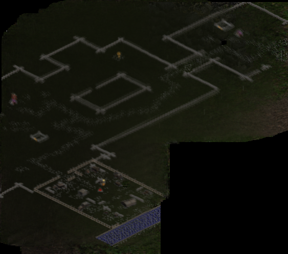

# Max Minimaps — Minimap Stitcher

Скрипт для склейки последовательности игровых миникарт в единое изображение глобальной карты.

## Результат



## Требования

- Python 3.7+
- OpenCV (`opencv-python-headless`)
- NumPy

```bash
pip install opencv-python-headless numpy
```

## Быстрый старт

```bash
# 1. Распаковать многотомный архив с миникартами
zip -s 0 minimaps.zip --out minimaps_full.zip
unzip minimaps_full.zip -d minimaps

# 2. Запустить склейку
python3 stitch_minimaps.py
```

Результат будет сохранён в `full_map.png`.

## Использование

```
python3 stitch_minimaps.py [input_dir] [output_file]
```

| Аргумент      | По умолчанию       | Описание                              |
|---------------|---------------------|---------------------------------------|
| `input_dir`   | `minimaps/minimaps` | Папка с файлами `mm_*.png`            |
| `output_file` | `full_map.png`      | Путь для сохранения итоговой карты     |

**Примеры:**

```bash
# Параметры по умолчанию
python3 stitch_minimaps.py

# Своя папка и имя выходного файла
python3 stitch_minimaps.py ./my_maps/ result.png
```

## Как это работает

1. **Загрузка** — миникарты загружаются в естественном порядке (`mm_1`, `mm_2`, …, `mm_231`).
2. **Маскирование маркеров** — синие и белые кресты (позиция игрока и другие маркеры) определяются по HSV-цвету и исключаются из расчётов.
3. **Выравнивание** — для каждой пары соседних кадров вычисляется смещение через template matching (нормализованная кросс-корреляция центральных 50% кадра).
4. **Композитинг** — все кадры размещаются на едином холсте; в зонах перекрытия берётся среднее значение по валидным (немаскированным) пикселям.
5. **Очистка дорог** — мелкие изолированные серые точки (дорожная разметка) удаляются морфологической фильтрацией + inpainting.

## Параметры масок

Маски настроены под конкретную игровую палитру:

- **Синий крест**: HSV H ∈ [100, 125], S ∈ [120, 255], V ∈ [80, 255]
- **Белый крест**: HSV S < 35, V > 200
- **Дорога**: насыщенность < 45, яркость 90–195, размер < 5×5 px

При работе с другой игрой/палитрой эти пороги можно изменить в функциях `create_cross_mask()` и `create_road_mask()`.

## Формат входных данных

- Файлы именуются `mm_N.png` (N — порядковый номер кадра)
- Все миникарты одного размера (272×251 px в данном наборе)
- Перекрытие между соседними кадрами ~60–95%
- Формат PNG, RGB
